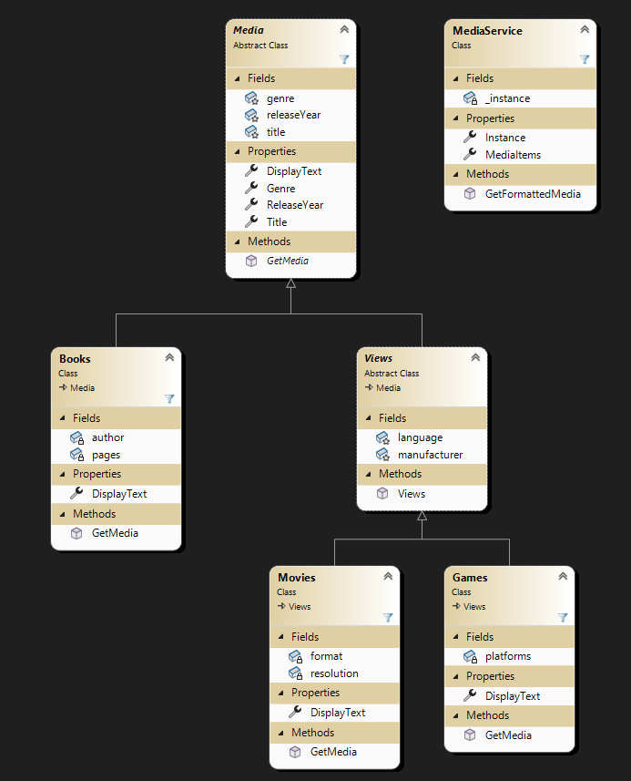

# PRG2 MAUI Media Library

Det här projektet är en del av en elevövning där syftet är att skapa en applikation med hjälp av MAUI och grundläggande principer i objektorienterad programmering (OOP). Fokus ligger på att implementera arv, polymorfism och singleton-mönster samtidigt som logik separeras från UI.

## Syfte

- Utforska och förstå objektorienterade koncept som arv och polymorfism.
- Implementera en lista som följer singleton-principen.
- Lära sig att separera logik och användargränssnitt i en MAUI-applikation.
- Praktiskt tillämpa abstrakta klasser och metoder i en arkitektur.

## Projektöversikt

### Klassdiagram

Projektets klassdiagram (se bild nedan) visar hur abstrakta klasser, arv och polymorfism används för att representera olika typer av media (böcker, filmer och spel). Alla klasser delar en gemensam abstrakt bas (`Media`) och implementerar sina egna unika egenskaper och metoder.

### Arkitektur

Projektet är uppdelat i följande delar:

- **Model**: Innehåller affärslogiken och representationen av data (t.ex. `Books.cs`, `Movies.cs` och `Games.cs`).
- **View**: Innehåller användargränssnittet med MAUI-sidor (t.ex. `ViewBooks.xaml`, `ViewGames.xaml`).
- **Service**: Hanterar logiken för datahantering (t.ex. `MediaService.cs`).

## Förutsättningar

För att kunna köra detta projekt behöver du:

- .NET 7.0 eller senare installerat på din dator.
- En IDE som Visual Studio 2022 med MAUI-stöd.
- Grundläggande kunskaper i objektorienterad programmering och MAUI.

## Några av funktionerna i master-branchen

I huvudbranchen (`master`) har applikationen följande funktionalitet:

1. **Lägga till böcker**: Möjligheten att lägga till nya böcker i systemet via användargränssnittet.
2. **Visa listan filtrerad**: En vy som visar innehållet i listan filtrerat för att enbart inkludera böcker.
3. **Visa allt innehåll**: MainPage visar allt innehåll i listan, oavsett typ (böcker, filmer eller spel).

### Strukturella detaljer:

- Klasser är strukturerade i en mapp som heter `Model`.
- UI-filer (XAML och code-behind) är placerade i mappen `View`.
- Listan med medieobjekt hanteras av en separat klass som heter `MediaService`, vilken inte är en del av klasshierarkin men används som en singleton.

### Begränsningar:

Du behöver själv lägga till funktioner i respektive klasser, vyer och code-behind för Games och Movies för att uppdatera listan, som är en ObservableCollection av Media.

Applikationen följer inte MVVM-arkitekturen i nuläget. Istället visas data direkt i användargränssnittet med hjälp av publika egenskaper i `Media`-klassen och dess subklasser, snarare än att använda metodik som exempelvis `GetMedia()`. Detta innebär att logiken för visning är mindre strukturerad och tät kopplad till modellen, vilket kan verka ologiskt.

---

## Planerade förbättringar i branchen `rearrange-to-mvvm`

I branchen `rearrange-to-mvvm` kommer projektet att omstruktureras för att följa MVVM-arkitekturen (Model-View-ViewModel):

1. **Lägga till en ny mapp: `ViewModel`**  
   - Den här mappen kommer att innehålla ViewModel-klasser som hanterar visning av data i användargränssnittet och bryter kopplingen mellan View och Model.

2. **Ersätta `MediaService`**  
   - Funktionaliteten i `MediaService` kommer att flyttas till ViewModel-klasserna för att bättre följa MVVM-mönstret.

3. **Separera logik och visning**  
   - Istället för att använda publika egenskaper i `Media`-klassen för att visa data i UI, kommer ViewModel-klasser att hantera dessa operationer och exponerar data på ett mer strukturerat sätt för användargränssnittet.

---
